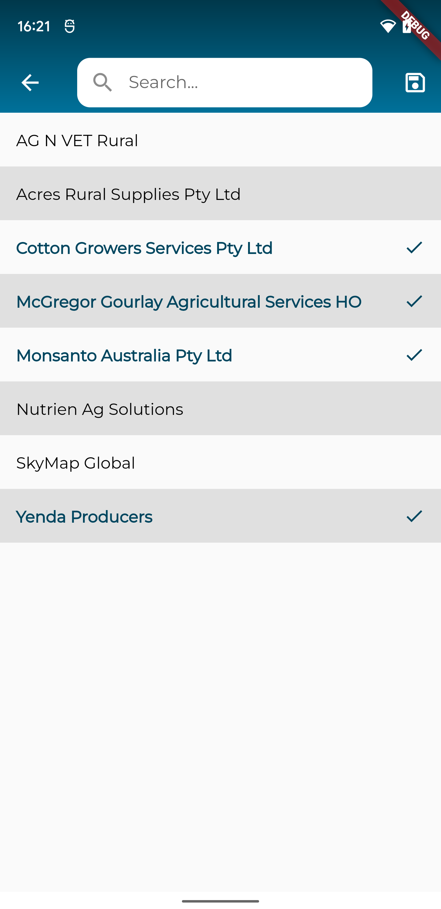
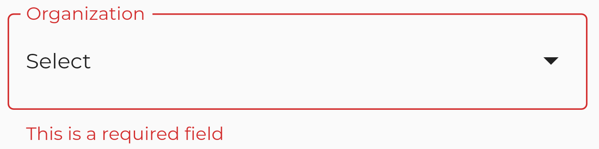
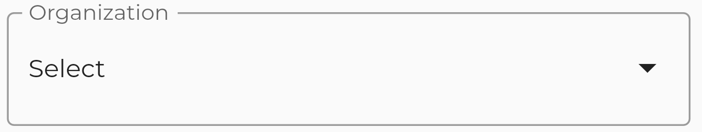
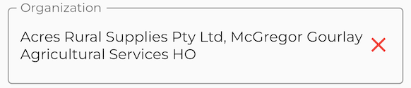
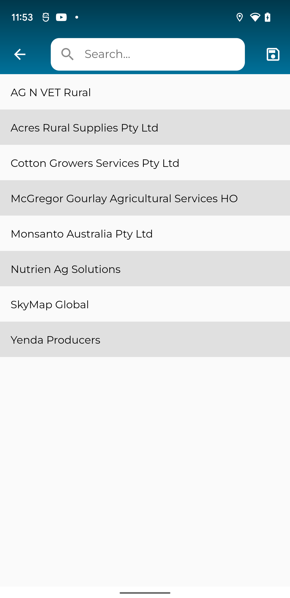
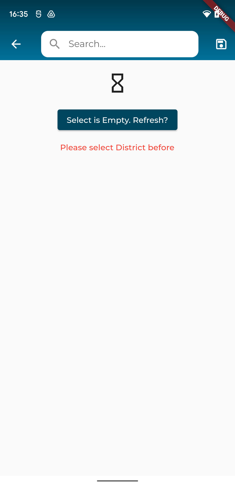

### Xây dựng một widget custom lại một `FormBuilderField` của [flutter_form_builder](https://pub.dev/packages/flutter_form_builder)
> Khi muốn tạo thêm một custom BuilderField thì cần kế thừa lại lớp `FormBuilderField` để có override lại phương thức `builder` và custom `state` của BuilderField

- VD ở dưới là mã nguồn của `FormBuilderTextField` được cung cấp sẵn ở package. Nó cũng được kế thừa từ lớp `FormBuilderField` và giá trị của nó quản lý sẽ kiểu dữ liệu là `<String>`
```
class FormBuilderTextField extends FormBuilderField<String> {
```
- Thực tế bây giờ ta đi xây dựng luôn chức năng của một `BuilderField` để chọn một/nhiều lựa chọn
- Đầu tiên thì cần xác định được kiểu dữ liệu trong danh sách lựa chọn. VD ở đây là `SelectOption`
```
@freezed
class SelectOption with _$SelectOption {
  const SelectOption._();

  const factory SelectOption({
    required dynamic id,
    required String name,
    @Default(false) bool selected,
  }) = _SelectOption;

  factory SelectOption.fromJson(Map<String, dynamic> json) =>
      _$SelectOptionFromJson(json);
}
```
- Lớp `SelectOption` sẽ bao gồm thông tin là định danh và tên của lựa chọn. Vì đây là một trường có thể chọn nhiều lựa chọn nên cần thêm thuộc tính `selected` để khi người dùng đã lựa chọn se được highlight lên trên giao diện




- Từ đấy ta có kiểu dữ liệu của `FormBuilderOptionPickerField` là `List<SelectOption>`
```
class FormBuilderOptionPickerField
    extends FormBuilderField<List<SelectOption>>
```
- Ở trong hàm khởi tạo `FormBuilderOptionPickerField`, cần giữ nguyên các thuộc tính của lớp base là `FormBuilderField` và truyền vào lớp base thông qua `super` thì trường mới sẽ giữ nguyên được các chức năng cơ bản của một `Field` như là phần `validator` xử lý xác thực dữ liệu hay callback `onSaved` được gọi khi giá trị của trường đó được lưu lại vào `Form`. Nếu cần thêm các thuộc tính khác cho trường custom mới thì ta chỉ cần thêm thuộc tính của `FormBuilderOptionPickerField` thông qua hàm khởi tạo là được
```
FormBuilderOptionPickerField({
    Key? key,
    required String name,
    FormFieldValidator<List<SelectOption>>? validator,
    List<SelectOption> initialValue = const [],
    InputDecoration decoration = const InputDecoration(),
    ValueChanged<List<SelectOption>?>? onChanged,
    ValueTransformer<List<SelectOption>?>? valueTransformer,
    bool enabled = true,
    FormFieldSetter<List<SelectOption>>? onSaved,
    AutovalidateMode autovalidateMode = AutovalidateMode.disabled,
    VoidCallback? onReset,
    FocusNode? focusNode,
    ...
  })
```
- Ở trong trường hợp này các thuộc tính thêm để xử lý các trường hợp

1. String `label`: Là tên hiển thị khi ta mở của sổ lựa chọn từ danh sách các lựa chọn `SelectOption`

2. bool `allowMultiple`: Mặc định là `false`. Nghĩa là mặc định chỉ được chọn một lựa chọn và ngược lại có thể chọn nhiều hay không

VD: Giao diện khi lựa chọn nhiều


3. List<SelectOption> `ignoreOptions`: Bài toán hiện tại là nếu có 2 trường chọn và sau khi trường 1 được chọn thì trường 2 không được chọn những giá trị của trường 1 đã chọn thì thuộc tính này giúp cho mình lọc phần data tránh ra các lựa chọn này

4. PickerType `pickerType`: Đây là `enum` để xác định cần lấy dữ liệu từ các nguồn nào và từ đó xác định được các `datasource` nên lấy từ đâu
```
enum PickerType {
  state,
  town,
  zone,
  valley,
  farmUnit,
  cotton,
  cropType,
  productType,
  plantingType,
  tsp,
  grower,
  dealer,
  farmer,
  organization,
  chartZone,
}
```
VD ở đây có nhiều `datasource` và mỗi cái đều có một `api` để lấy được dữ liệu riêng

5. List<SelectOption>? `refIds`: Bài toán là có thể trường sau có thể phụ thuộc vào giá trị của trường trước để lấy được giá trị. VD nếu muốn lấy được danh sách các quận huyện của tỉnh thì ta cần lấy được tỉnh đã lựa chọn được sau đó mới lấy được danh sách các huyện thuộc tỉnh đó

6. bool `isRef`: Liên quan đến thuộc tính `refIds`. Mục đính là khai báo xem trường này có phụ thuộc vào giá trị của trường khác hay không

7. String? `refName`: Liên quan đến thuộc tính `refIds`. Mục đích là khi thấy giá trị của `refIds` chưa có và có thuộc tính này thì chứng tỏ giá trị phụ thuộc của nó chưa được lựa chọn trước thì cần thông báo lên là cần phải lựa chọn thuộc tính `refName` trước

- Sau khi xác định các thuộc tính cần thêm vào custom `FormBuilderOptionPickerField` thông qua các yêu cầu của bài toán thì ta cần xây dựng phần giao diện cho ô chọn này thông qua thuộc tính `builder` của `FormBuilderField`
```
builder: (FormFieldState<List<SelectOption>?> field) {
  final state = field as _FormBuilderOptionPickerState;
  return InkWell(
    onTap: () => state.pickOptions(field),
    child: InputDecorator(
      decoration: decoration.copyWith(errorText: field.errorText),
      child: state.defaultFileViewer(
        field,
      ),
    ),
  );
});
```
1. Giao diện hiển tại vẫn chỉ là `custom` từ một `InputDecorator` và tương tự có thể thay đổi thông qua `InputDecoration` tương tự như các `fields` khác đã được dững sắn như là `FormBuilderCheckbox`, `FormBuilderTextField`, `FormBuilderDateRangePicker`,... Mục đích của điều này là để giao diện giữa các `field` được đồng đều và thống nhau theo cùng một kiểu. Tùy `mục đích` mà ta có thể thay đổi khác

2. Ở đây đặc biệt phải ghi nhớ cần truyền thuộc tính `field.errorText` vào `decoration` vì nó là thuộc tính thông báo lỗi khi `validate` dữ liệu.



3. Tương tự như một `StatefulWidget` thì `FormBuilderField` hỗ trợ ta xây dựng một `state` đi kèm với `field` muốn `custom` này. `state` này sẽ được khởi tạo thông qua ghi thực thi cho phương thức `createState`
```
@override
_FormBuilderOptionPickerState createState() {
  return _FormBuilderOptionPickerState();
}
```

4. Phần giao diện hiển thị trước và sau khi click sẽ được quy định trong phương thức `defaultFileViewer` sẽ trả về `Widget`
```
Widget defaultFileViewer(
  FormFieldState<List<SelectOption>?> field,
) {
  return Row(
    mainAxisAlignment: MainAxisAlignment.spaceBetween,
    children: [
      Expanded(
        child: field.value?.isNotEmpty == true
            ? Text(
                field.value!.map((e) => e.name).join(", "),
                style: const TextStyle(
                  fontWeight: FontWeight.w500,
                ),
              )
            : Text(
                widget.label,
              ),
      ),
      field.value?.isNotEmpty == true
          ? GestureDetector(
              child: const Icon(
                Icons.close,
                color: Colors.red,
              ),
              onTap: () => field.didChange(null),
            )
          : const Icon(Icons.arrow_drop_down),
    ],
  );
}
```
> Ở đây xảy ra các trường hợp. Nếu mà chưa có giá trị thì ta hiển thị tên(`label`) mặc định thể hiện là trường này chưa được chọn giá trị gì. Nếu mà giá trị đã được chọn thì ta hiện danh sách `name` của các lựa chọn này ra cho người dùng biết là đã lựa chọn nào(giá trị của `field` có thể nhiều như đã giải thích ở trên)




> Nếu mà người dùng đã lựa chọn thì ta có thể thêm lựa chọn xóa nhanh tất cả các lựa chọn thông qua một `button` sau khi `click` ta có thể đặt lại giá trị cho trường này thông qua phương thức `didChange`

5. Muốn lựa chọn được từ danh sách thì ý tưởng hiện tại là sau khi `click` vào `field` này thì sẽ gọi `onTap` để thực thi phương thức `pickOptions` của `state` để thực hiện xử lý phần lựa chọn này

> Đầu tiên là ta cần xây dựng một màn hình mới để hiện thị lên danh sách các lựa chọn và chức năng chọn. Sau đó là chỉ cần chờ đợi kết quả sau khi chuyển trang sang màn mới này
```
final result = await Navigator.push<List<SelectOption>?>(
  context,
  MaterialPageRoute(
    builder: (context) => BlocProvider(
      create: (_) => FilterBloc(DI.resolve()),
      child: FilterOptionPickerPage(
        label: widget.label,
        pickerType: widget.pickerType.name,
        isRef: widget.isRef,
        refId: widget.refIds?.firstOrNull?.id?.toString(),
        refName: widget.refName,
        allowMultiple: widget.allowMultiple,
        ignoreOptions: widget.ignoreOptions,
      ),
    ),
  ),
);

if (result is List<SelectOption>) {
  field.didChange(result);
}
```
> Ở đây `result` chính là kết quả các lựa chọn ở màn hình vừa xây dựng ở trên và tương tự nếu có kết quả thì ta muốn gán giá trị cho `field` này thì chỉ cần gọi phương thức `didChange` và truyền vào giá trị

> Tại sao lại cần `bloc`?: `field` này có thể lựa chọn nhiều `datasource` và được lấy thông qua các `api` khác nhau vì vậy cần xây dựng màn hình lựa chọn theo kiến trúc `clean architecture` và `bloc` giúp ta xử lý các `datasource` khác nhau. Sẽ được trình bày ở dưới

### Xây dựng màn hình để lựa chọn
> VD: Màn hình xây dựng với `datasource` là `orgnazation`



> Các thành phần cần xây dựng là

1. Thanh `AppBar` gồm nút `back`, `ô tìm kiếm` và `nút lưu`
2. Phần `body` hiển thị danh sách các `SelectOption` để lựa chọn

> Lưu ý: Nếu mà chọn một thì sẽ đóng màn hình và trả về kết quả luôn
Nếu chọn nhiều thì `highlight` những lựa chọn và muốn trả kết quả thì ấn nút `save`

> Đầu tiên cần xây dựng phần datasource với kiến trúc `clean architecture`

```
@RestApi(baseUrl: AppUrl.baseUrl)
abstract class FilterService {
  factory FilterService(Dio dio) = _FilterService;

  @GET(AppUrl.states)
  Future<List<SelectOption>> getStates();
  ...
}
```

VD trên là phần service với `datasource` là `state`

```
enum PickerType {
  state, [territories/states]
  town, [territories/towns?state_id=?]
  zone, [territories/zones]
  valley, [territories/valleys?zone_id=?]
  farmUnit, [farm_units?per_page=all]
  cotton, [lookup/cotton_choice?per_page=all]
  cropType, [lookup/crop_type?per_page=all]
  productType, [lookup/product_type?per_page=all]
  plantingType, 
  tsp, [tsps?per_page=all]
  grower, [growers?per_page=all]
  dealer, [dealers?per_page=all]
  farmer, [farmers?per_page=all&dealer_id=?]
  organization, [organizations]
  chartZone,
}
```

Tương tự xây dựng đến phần `usecase` ứng với mỗi `datasource`

> Sau khi xây dựng được module `bloc` cho màn hình `FilterOptionPickerPage` thì việc cần làm lúc vào màn hình trong `lifecycle initState` ta chỉ việc gọi `event` để lấy dữ liệu

> Khối `event`:

```
class FilterGetDataEvent extends FilterEvent {}
class FilterSearchTermChangeEvent extends FilterEvent {}
class FilterSelectOptionEvent extends FilterEvent {}
```

- Lớp `FilterGetDataEvent` dùng để xác định xem cần lấy `datasource` nào
- Lớp `FilterSearchTermChangeEvent` dùng để lưu lại giá trị trong thanh tìm kiếm để phục vụ cho phần `filter` các lựa chọn
- Lớp `FilterSelectOptionEvent` dùng để cập nhật xem `SelectOption` nào được chọn và highlight lên giao diện thông qua thuộc tính `selected`

> Khối `bloc`:
```
void _onGetData(FilterGetDataEvent event, Emitter<FilterState> emit) async {
  emit(state.copyWith(loading: true, error: ''));
  late Either<String, List<SelectOption>> result;
  if (event.pickerType == PickerType.state.name) {
    result = await _filterUserCase.getStates();
  } else if (event.pickerType == PickerType.town.name) {
    result = await _filterUserCase.getTowns((event.refId ?? '').toString());
  } else if (event.pickerType == PickerType.zone.name) {
    result = await _filterUserCase.getZones();
  }
  ...

  final next = result.fold((l) => state.copyWith(loading: false, error: l),
      (data) => state.copyWith(loading: false, data: data));
  emit(next);
}
```

- Phương thức `_onGetData` để xử lý việc cần lấy `datasource` nào thông qua thuộc tính `pickerType` từ đó xác định được `usecase` cần gọi. Sau khi lấy được danh sách dữ liệu thì cần `emit` một state chứa danh sách đó

> Sau khi xử lý được tầng `data layer` và `domain layer` thì việc cần thực hiện tiếp là xây dựng phần `presentation` cụ thể là phần `ui` vì phần `bloc` đã được xử lý xong. Thực chất là `widget: FilterOptionPickerPage`

- Phương thức `_fetchData` gọi event `FilterGetDataEvent` bao gồm các thông tin là `refId`(phụ thuộc trường nào nếu có) và `pickerType`(loại `datasource` nào: `enum`)

- Getter `memoIgnoreOptions` dùng để xác định nhanh là những `SelectOption` nào cần được loại bỏ khỏi danh sách lựa chọn(thuộc tính `ignoreOptions` đã trình bày ở các tham số của trường)

```
final filterData = state.data.where((element) =>
  !memoIgnoreOptions.containsKey(element.id) &&
  element.name
          .toLowerCase()
          .contains(state.searchTerm.toLowerCase()) ==
      true);
```

`filterData` chính là danh sách các lựa chọn sẽ được hiển thị lên màn hình thông qua `SliverList`(tương tự `ListView`). Sau khi có danh sách lựa chọn từ datasource và được lấy từ `state của bloc` thì đầu tiên cần lọc ra những `SelectOption` cần loại bỏ thông qua getter `memoIgnoreOptions`. Tiếp theo lọc những kết quả chỉ chứa chuỗi được nhập thông qua ô tìm kiếm thông qua phương thức `where`

- Việc cuối cùng là xác định phần giao diện cần hiển thị dựa vào các trạng thái 
1. Đang lấy dữ liệu
2. Dữ liệu lấy về từ `datasource` là rỗng


3. Có lỗi xảy ra khi lấy dữ liệu


4. Xác thực đầu vào của trường như nếu mà phụ thuộc vào trường khác thông qua thuộc tính `isRef` thì thông báo cần lựa chọn trường dữ liệu kia trước



5. Có dữ liệu cần lựa chọn


