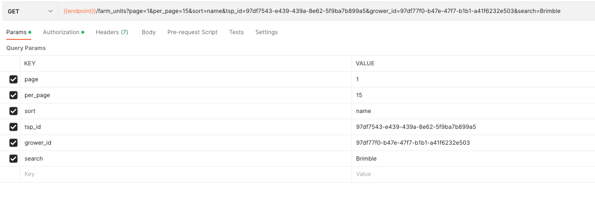
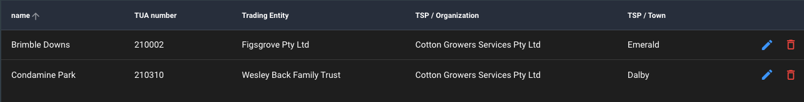

## Xây dựng trang TSP Management
### 1. Nguồn dữ liệu
[https://demobayer.eofactory.ai/core/api/farm_units?page=1&per_page=15&sort=name&tsp_id=97df7543-e439-439a-8e62-5f9ba7b899a5&grower_id=97df77f0-b47e-47f7-b1b1-a41f6232e503&search=Brimble](https://demobayer.eofactory.ai/core/api/farm_units?page=1&per_page=15&sort=name&tsp_id=97df7543-e439-439a-8e62-5f9ba7b899a5&grower_id=97df77f0-b47e-47f7-b1b1-a41f6232e503&search=Brimble)

> Các params trên phương thức GET 
- search(không bắt buộc): Từ khóa để tìm kiếm trong thuộc tính name
- page(bắt buộc): Page hiện tại cần lấy danh sách
- per_page(không bắt buộc/mặc định: 5): Số phần tử trong một page
- sort(không bắt buộc): Cần sắp xếp theo thứ tự của thuộc tính nào. Mặc định không có dấu trừ là A->Z và ngược lại là Z->A với dấu trừ
- tsp_id(không bắt buộc): Định danh id của TSP Branch
- grower_id(không bắt buộc): Định danh id của Trading Entity

>Ví dụ:

### 2. Xây dựng giao diện
>Hiện tại chỉ cần giao diện quản lý với dạng bảng và chưa cần lọc theo search và orginazation

- Giao diện ở phía web để tham khảo các cột cần xây dựng

