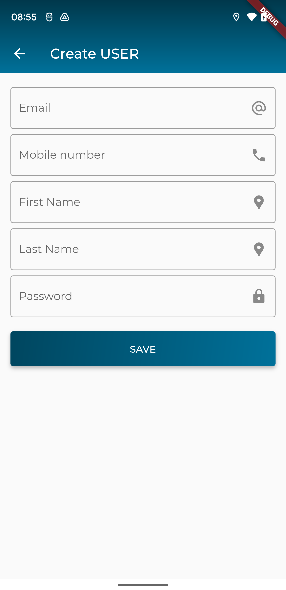
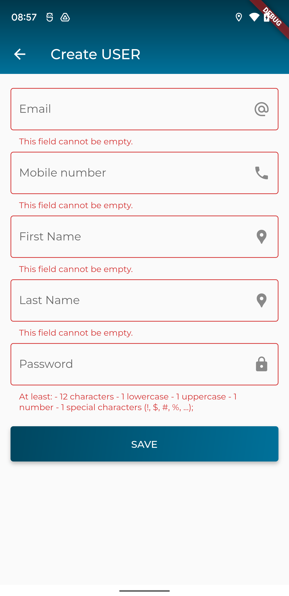

### Xây dựng màn hình tạo mới/cập nhật một Farm Unit

> Giao diện đề xuất



> Giao diện khi xác thực dữ liệu khi người dùng nhập liệu chưa đúng



> API để tạo mới Farm Unit: `/farm_units`

dữ liệu cần gửi lên dưới dạng json
```
{
  "information": {},
  "name": "Name",
  "role_id": 3,
  "tua_number": "TUA",
  "grower_id": "97df77f0-b47e-47f7-b1b1-a41f6232e503",
  "tsp_id": "97df667c-bfe3-494e-a131-9793a50456f2"
}
```
trong đó
- `grower_id`: là định danh của Trading Entity đã chọn
- `tsp_id`: là định danh của TSP Branch đã chọn
- `role_id`: mặc định là 3. không cần thay đổi thuộc tính này
- `information`: mặc định là đối tượng rỗng. không cần thay đổi thuộc tính này
> API để cập nhật Farm Unit: `/farm_units/{id}`
trong đó
- `id`: là định danh của Farm Unit cần cập nhật thông tin

