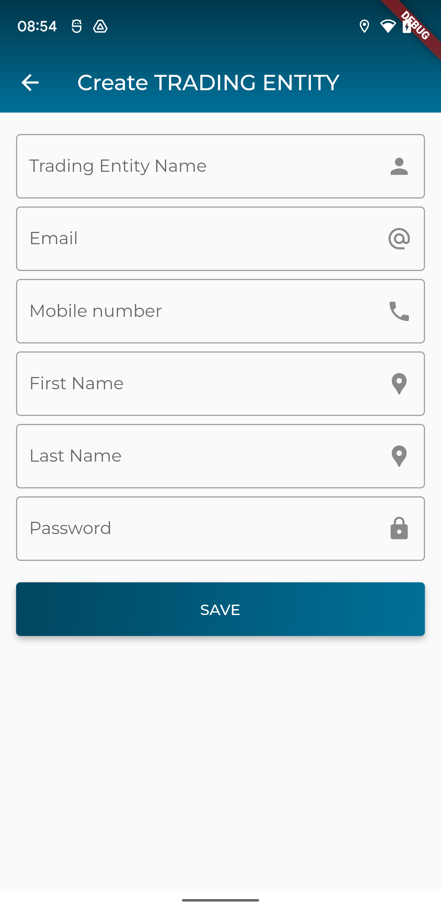
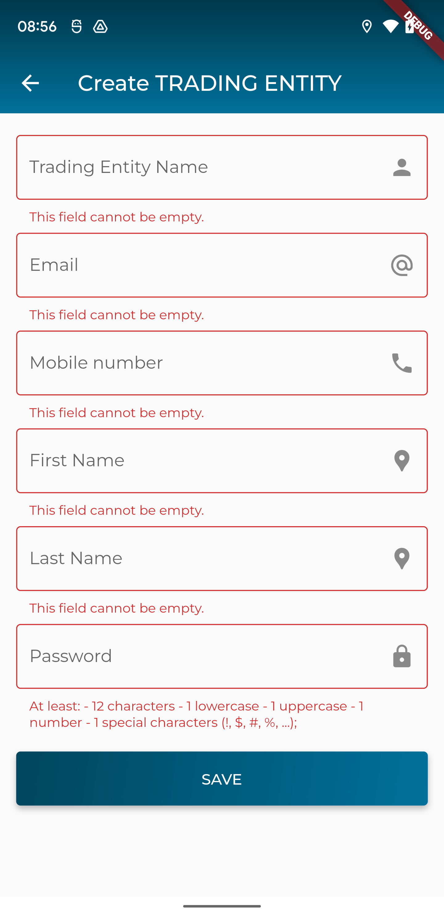

### Xây dựng màn hình tạo mới/cập nhật một Trading Entity

> Giao diện đề xuất



> Giao diện khi xác thực dữ liệu khi người dùng nhập liệu chưa đúng



> API để tạo mới Trading Entity: `/growers`

dữ liệu cần gửi lên dưới dạng json
```
{
  "name": "Hung Tran Test",
  "first_name": "Hung",
  "password": "0123456789Aa@",
  "last_name": "Tran",
  "email": "hung.tv@eofactory.ai",
  "mobile_number": "0961112381"
}

> API để cập nhật Trading Entity: `/growers/{id}`
trong đó
- `id`: là định danh của tsp branch cần cập nhật thông tin