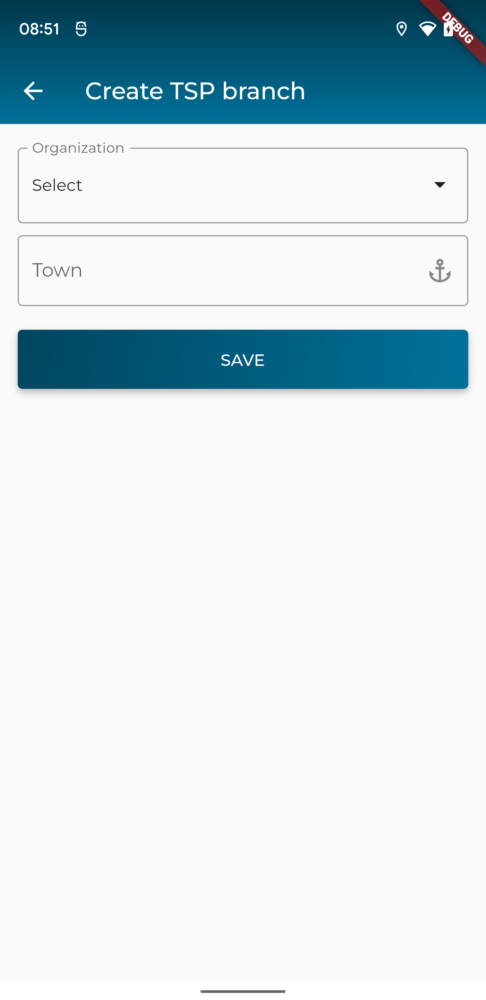
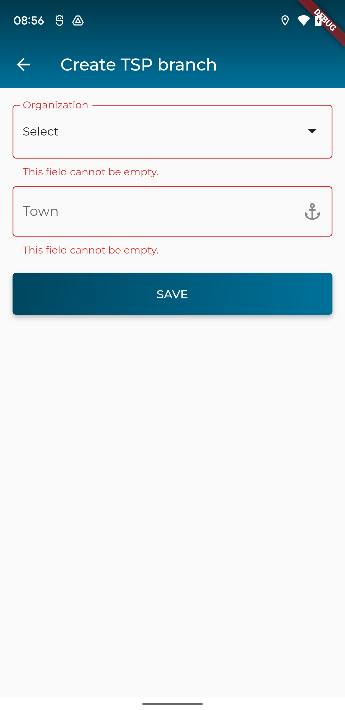

### Xây dựng màn hình tạo mới/cập nhật một TSP Branch

> Giao diện đề xuất



> Giao diện khi xác thực dữ liệu khi người dùng nhập liệu chưa đúng



> API để tạo mới TSP Branch: `/tsps`

dữ liệu cần gửi lên dưới dạng json
```
{
  "town": "Hung TSP Branch Test",
  "organization": "Acres Rural Supplies Pty Ltd"
}
```
trong đó
- `town`: string
- `organization`: string|tên của organization đã chọn

> API để cập nhật TSP  Branch: `/tsps/{id}`
trong đó
- `id`: là định danh của tsp branch cần cập nhật thông tin
