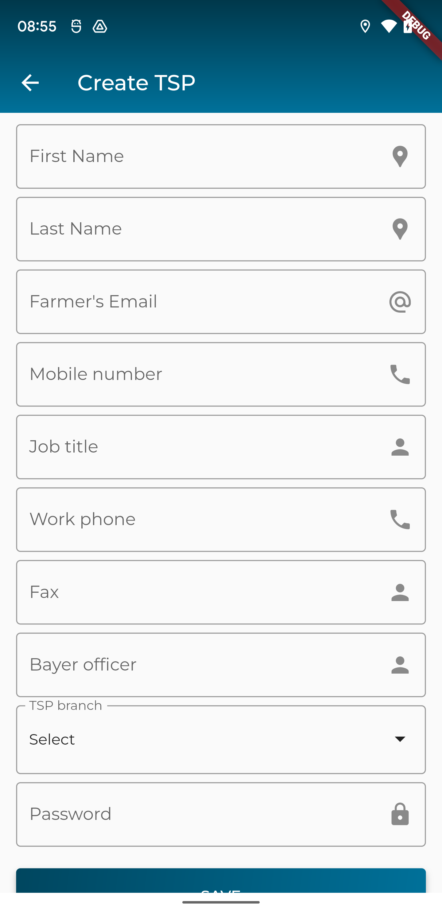
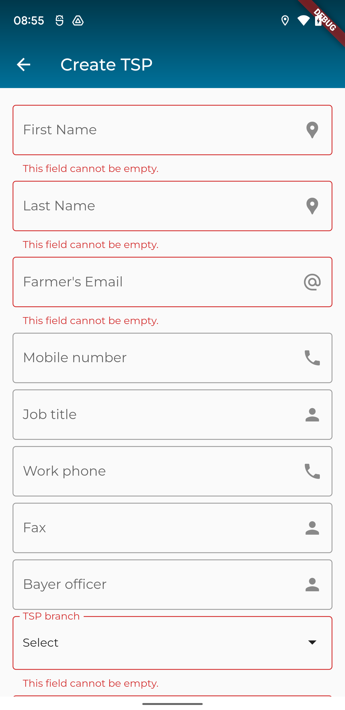
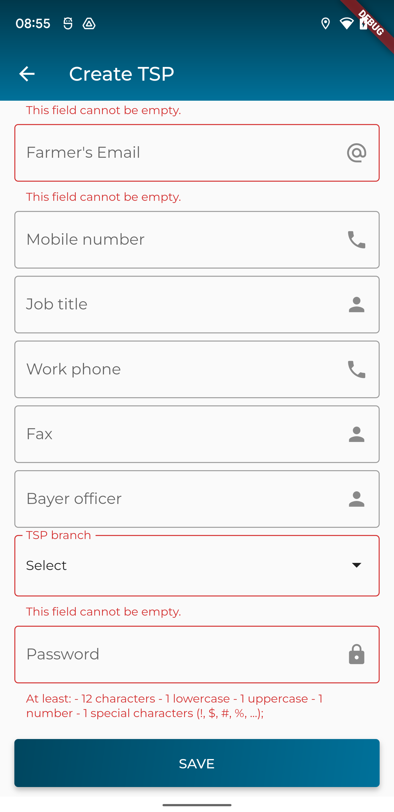

### Xây dựng màn hình tạo mới/cập nhật một TSP

> Giao diện đề xuất



> Giao diện khi xác thực dữ liệu khi người dùng nhập liệu chưa đúng




> API để tạo mới TSP: `/staffs`

dữ liệu cần gửi lên dưới dạng json
```
{
  "first_name": "First Name",
  "password": "12312adsdasd2asdA@",
  "last_name": "Last Name",
  "email": "Email@fa.ca",
  "tsp_id": "97df667c-bfe3-494e-a131-9793a50456f2",
  "mobile_number": 1111111111,
  "job_title": "Job title",
  "work_phone": "2111111111",
  "fax": "3111111111",
  "bayer_officer": "officer"
}
```
trong đó
- `tsp_id`: là định danh của TSP Branch đã chọn
> API để cập nhật TSP: `/staffs/{id}`
trong đó
- `id`: là định danh của TSP cần cập nhật thông tin

