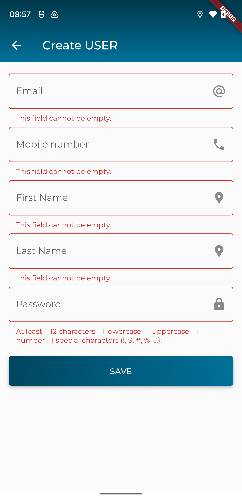

### Xây dựng màn hình tạo mới/cập nhật một User

> Giao diện đề xuất


> Giao diện khi xác thực dữ liệu khi người dùng nhập liệu chưa đúng



> API để tạo mới User: `/users`

dữ liệu cần gửi lên dưới dạng json
```
{
  "first_name": "Hung",
  "password": "0123456789A@a",
  "last_name": "Test",
  "email": "hung.tv2@eofactory.ai"
}
```

> API để cập nhật User: `/users/{id}`
trong đó
- `id`: là định danh của User cần cập nhật thông tin

