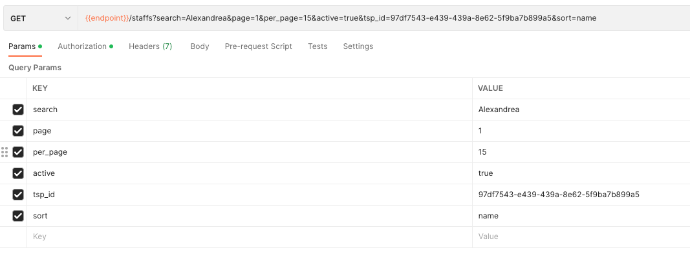
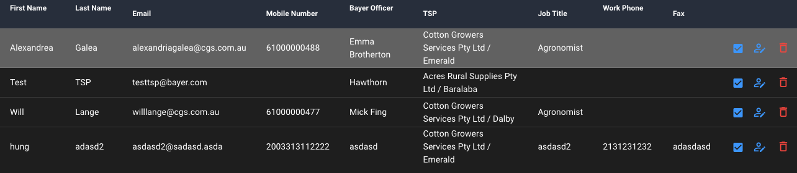

## Xây dựng trang TSP Management
### 1. Nguồn dữ liệu
[https://demobayer.eofactory.ai/core/api/staffs?search=Alexandrea&page=1&per_page=15&active=true&tsp_id=97df7543-e439-439a-8e62-5f9ba7b899a5&sort=name](https://demobayer.eofactory.ai/core/api/staffs?search=Alexandrea&page=1&per_page=15&active=true&tsp_id=97df7543-e439-439a-8e62-5f9ba7b899a5&sort=name)

> Các params trên phương thức GET 
- search(không bắt buộc): Từ khóa để tìm kiếm trong thuộc tính name
- page(bắt buộc): Page hiện tại cần lấy danh sách
- per_page(không bắt buộc/mặc định: 5): Số phần tử trong một page
- active(không bắt buộc/mặc định: true): Trạng thái đang được active hoặc không trên hệ thống
- sort(không bắt buộc): Cần sắp xếp theo thứ tự của thuộc tính nào. Mặc định không có dấu trừ là A->Z và ngược lại là Z->A với dấu trừ
- tsp_id(không bắt buộc): Định danh id của TSP Branch

>Ví dụ:

### 2. Xây dựng giao diện
>Hiện tại chỉ cần giao diện quản lý với dạng bảng và chưa cần lọc theo search và orginazation

- Giao diện ở phía web để tham khảo các cột cần xây dựng

