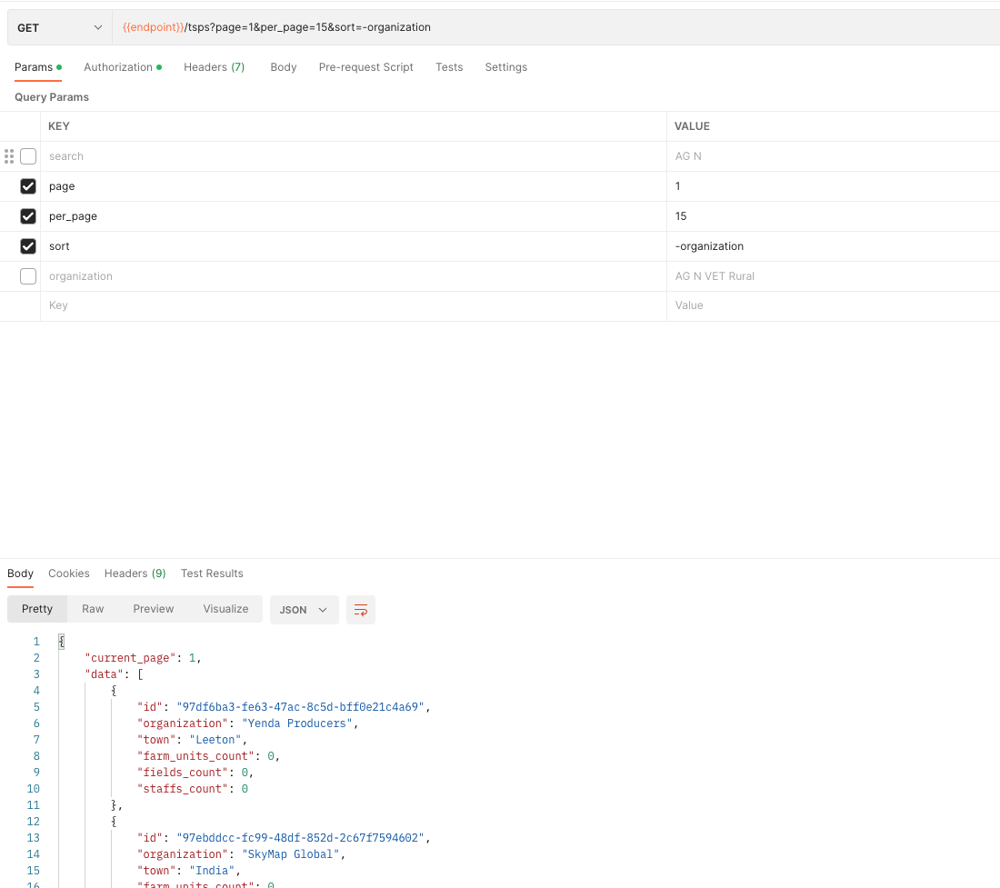
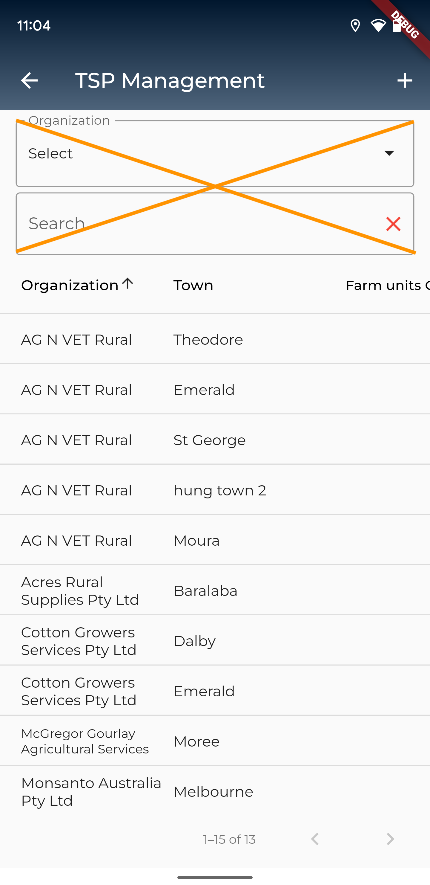
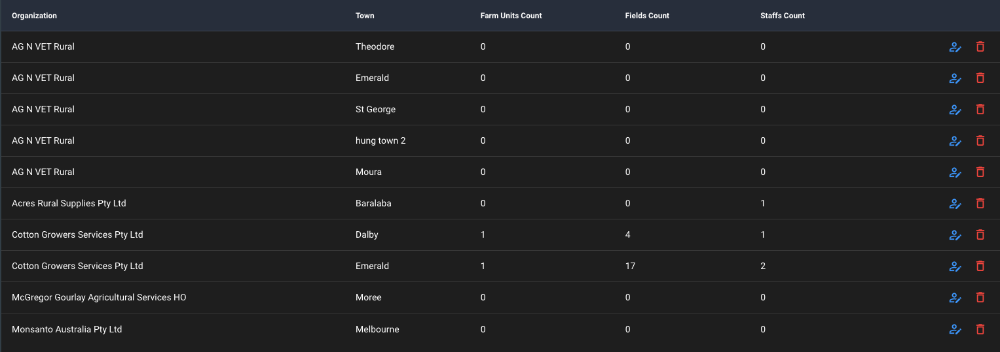

## Xây dựng trang TSP Management
### 1. Nguồn dữ liệu
[https://demobayer.eofactory.ai/core/api/tsps?search=AG N&page=1&per_page=15&sort=-organization&organization=AG N VET Rural](https://demobayer.eofactory.ai/core/api/tsps?search=AG N&page=1&per_page=15&sort=-organization&organization=AG N VET Rural)

> Các params trên phương thức GET 
- search(không bắt buộc): Từ khóa để tìm kiếm trong thuộc tính organization của tsp
- page(bắt buộc): Page hiện tại cần lấy danh sách tsp
- per_page(không bắt buộc/mặc định: 5): Số phần tử trong một page của tsp
- sort(không bắt buộc): Cần sắp xếp theo thứ tự của thuộc tính nào. Mặc định không có dấu trừ là A->Z và ngược lại là Z->A với dấu trừ
- organization(không bắt buộc): Tên của organization mà các tsp chỉ thuộc trong organization đấy

>Ví dụ:

### 2. Xây dựng giao diện
>Hiện tại chỉ cần giao diện quản lý với dạng bảng và chưa cần lọc theo search và orginazation

- Giao diện ở phía mobile

- Giao diện ở phía web để tham khảo các cột cần xây dựng

>Sử dụng thư viện [data_table_2](https://pub.dev/packages/data_table_2) để hỗ trợ xây dựng giao diện dạng bảng với nhiều chức năng hỗ trợ

>Thêm cột có sẵn các nút sửa(màu xanh) và xóa(màu đỏ). Hiện tại chỉ cần xây dựng giao diện